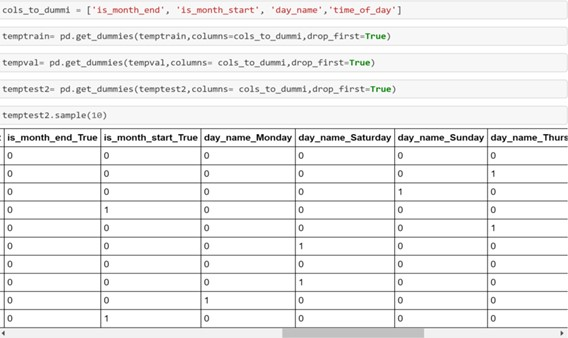
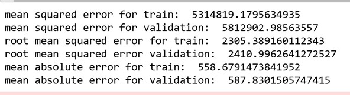

# Introduction

## Objective:

Our goal for this project is to forecast production or farm yield based on other variables such as location, season,crop,andlandarea.Wewanttoknowhowcropyieldisaffectedbytheseasonandgeography,as both impact Yield. We also want to find how variation of yield is by the area undercultivation.

## Problems to beaddressed:

    - Investigate the data and create newfeatures
    - Estimate each farm crop's production.
    - Create a sourcing plan for an ingredient based on expected demand for the next fewmonths.

## Approach:

For this analysis we have taken agricultural dataset and climate dataset from Kaggle and merged them based on the common fields to predict crop yield. We built 5 different models and compared the results to find the best model for our analysis.

# DataSynthesis

## DataOverview

Ourdataisaround2080580bytesinsize,with17properties.Farmdata,traindata, andweatherdata,all of which contain a combination of category and numeric variables, are contained in three datasets. The attribute yield is an independent variable, while the rest of the attributes are dependent. We have used the data from year 2016 as training data and used the 2017 data to as test data to dopredictions.

#### Farm Yield Data

| Farm id | Unique farm ids |
| --- | --- |
| Date | Dates per hour from 2016 in train and from 2017 in test |
| Ingredient\_type | Type of ingredient in the farm : There are 4 types - w,x,y,z |
| Yield | Yield for each farm per hour |

#### Farm Data

| Farm id | Unique farm ids |
| --- | --- |
| operations\_commencing\_year | Year the farm has started |
|
num\_processing\_plants |
processing plants present in the location/ farm |
| farm\_area | Area of the given farm |
| farming\_company | The company that owns the farm |
| deidentified\_location | Location of the farm |

#### Weather data

| Timestamp | Dates at which the weather was calculated at each hour |
| --- | --- |
| deidentified\_location | Location of the farm |
| temp\_obs | Temperature at that hour |
| Cloudiness | Clouds present in the sky at that hour |
| wind\_direction | The direction of the wind at the hour |
| dew\_temp | Dew temperature at the hour |
| pressure\_sea\_level | Pressure sea level at the hour |
| Precipitation | Rainfall at the hour |
| wind\_speed | Wind speed at that hour |

 
## DataProcessing:

1. Converted date, timestamp to datetimeformat
2. Checking and clearingduplicates
3. **135568** duplicate records have different yieldvalues
  - Dropped the duplicates by copying to another dataframe
  - Taken average and replaced the mean for duplicatevalues
  - Merge the average replaced records back with originaldata
  - **148920** records are dropped as whole rows are duplicated in thetable
4. Identified the percentage of null values in eachcolumn
  - Dropped columns with missing value percentage \>40%
  - Imputation is performed for records with missing values \< 40% usingmean.
  - Imputing with mode i.e. as 0 is occurring majority of the times inprecipitation
5. Merge operation onData
  - Farm\_data + test -\> initial\_merged\_test (+ weather\_test) -\> finaltest
  - Farm\_data + train -\> initial\_merged\_train (+ weather\_train) -\> finaltrain
6. Removed outliers with **z-score \>** 1.96
7. Removing columns that are no longer needed like Weekday, Index, Date, andTimestamp
8. Label Encoding is done for categoricalcolumns
9. Extracted Features from Time stamp suchas:
  - Time Stamp: Extracting features from datetime as weekday, day\_name, dayofyear, day, month, is\_month\_end,is\_month\_start
  - Weekend or Weekday: Appending weekend with 0 and weekday with1
  - Morning Evening Night: Segregated time into categoricalvariables
  - Splitting the data for validation Data split is done based on time stamp. For train data we used 2016 data and for test data, 2017 data is used for all months and compared yields based onmonths.

**MODEL BUIDLING**

Dummification is performed on columns such as is\_month\_end, is\_month\_start, day\_name,time\_of\_day

After dummification, Linear Regression model is performed which resulted in **mean absolute error** of

573.68 and mean squared error is 5663965.13.

### DecisionTree

Decision Tree is performed without outliers and with hyperparameter and we get to compare the results.

### Without Outliers:

### Hyperparameter:

### Learning Curve:

### RandomForest

Before changes we got Mean absolute error of 587.83 and mean squared error was 5812902.98

### XGBoost:

Preprocessing: Label Encoding done on columns dayofyear, day and hour

**MAE value for XG Boost** is 575.912

# Evaluations andResults

### EvaluationMethods

Compared the errors of all the models performed and evaluated theresults

| Linear Regression | Decision Tree without outlier | Decision Tree with Hyperparameter | Random Forest | XG Boost |
| --- | --- | --- | --- | --- |
| 573.8 | 143.86 | 563.30 | 558.67 | 573 |

When compared to all other models, the **Decision Tree without outliers** produces the least error, hence it is the best model to utilize for agricultural yield production.

Compared Yield produced - Actual Versus OriginalDemand:

Predicted yield for every month for 2017 is presented below

### EXPECTED YIELD FOR EACH MONTH IN 2017:

**Results and Findings**

Extra Yield is calculated by comparing actual consumption to the original demand, making it easier to predict and develop crops to meet future needs.

1. Conclusions and Future Work
  1. Conclusions
    - Among all the models evaluated, the Decision Tree is the mostappropriate.
    - The monthly harvest is more than enough forconsumption.
    - Any excess product can be preserved for futureuse.
  2. Limitations
    - Cropforecastwasbasedon2yearsofdata;however, thenumberofyearsanalyzed mightbe increased to obtain a more efficient conclusion based on annual demandincreases.
    - Future demand can be forecasted using previous data for the next number of years, ratherthan just one ortwo.
  3. Potential Improvements or Future Work
    - Density Based clustering Technique can be used on Crop yieldPrediction.
    - Factors affecting agricultural yield output can be identified and worked towards anefficient method of yield prediction using the density-based clusteringtechnique.

**References**

- [https://realpython.com/linear-regression-in-python/](https://realpython.com/linear-regression-in-python/)
- [https://towardsdatascience.com/random-forest-in-python-24d0893d51c0](https://towardsdatascience.com/random-forest-in-python-24d0893d51c0)
- [https://arxiv.org/ftp/arxiv/papers/2105/2105.01282.pdf](https://arxiv.org/ftp/arxiv/papers/2105/2105.01282.pdf)
- [https://ai.plainenglish.io/hyperparameter-tuning-of-decision-tree-classifier-using-gridsearchcv-](https://ai.plainenglish.io/hyperparameter-tuning-of-decision-tree-classifier-using-gridsearchcv-2a6ebcaffeda)[2a6ebcaffeda](https://ai.plainenglish.io/hyperparameter-tuning-of-decision-tree-classifier-using-gridsearchcv-2a6ebcaffeda)
- [https://towardsdatascience.com/step-by-step-guide-building-a-prediction-model-in-python-](https://towardsdatascience.com/step-by-step-guide-building-a-prediction-model-in-python-ac441e8b9e8b)[ac441e8b9e8b](https://towardsdatascience.com/step-by-step-guide-building-a-prediction-model-in-python-ac441e8b9e8b)
